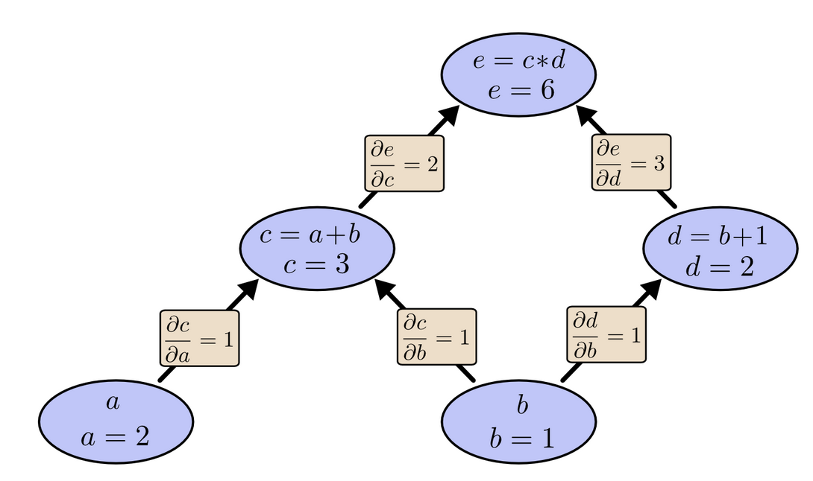

最近最优化方法这门课上提到一些机器学习相关建模，包括**AD**,PCA,SVM,DNN等，几周前便想写一篇博客用于记录，但苦于没有时间。今天时间充足，尝试写一点。不求完美，后续有新的想法再补充。

# 自动微分是什么？
如我前言，**自动微分(Automatic Differentiation)**,简称AD。首先，请允许我做一些说明：**自动微分**的“微分”与微积分中的“微分”有差异！在微积分中，微分(Differentiation)，是函数在某一点处的线性近似增量，用导数与自变量微分的乘积表示，核心是“以线性逼近非线性”，忽略高阶无穷小。而在这里，自动微分中的“微分”一词，个人认为实际指“求导运算”，不是 dy,`differentiation as a process of computing derivatives`. 自动(Automatic),是相对手动(manial)而言，也就是手动计算。所以，自动微分就是使用计算机编写程序，“自动”求解函数在某一处的导数/梯度。自动微分可用于计算神经网络反向传播的梯度大小，是机器学习训练中不可获取的一步。后续行文中，“`微分`”的说法，实质上是指`计算导数`。


# 微分方法分类
也就是如何求导？我相信在高中时，大家都会这件事了吧！记得当时用得最多的办法就是**记住**常用的基本初等函数求导公式。当然，你的数学老师可能进行了一些简单公式的推导。这里提供一个链接，提供了[基本初等函数求导公式](https://math.fandom.com/zh/wiki/%E5%9F%BA%E6%9C%AC%E5%88%9D%E7%AD%89%E5%87%BD%E6%95%B0%E7%9A%84%E5%AF%BC%E6%95%B0)，以及利用比值定义式取极限进行证明。这些公式里，有的很好记忆，例如幂函数，但大部分比较难记忆，例如，三角/反三角函数，双曲函数等...如果你不是经常使用，我相信大部分人会很快忘记的。但好在现在有了新工具帮助我们解决这个难题————**自动微分**。在TensorFlow、PyTorch都实现了自动微分，使用时直接调包即可。不过，作为计算机专业兼人工智能专业学生，学习其原理是十分有必要的。

为了更好的理解“自动微分”，我们需要先理解常见的求解微分的方式。（如前文所说，这里的“微分”是指“求导运算”）可分为一下四种：
- Manual Differentiation
- Numerical Differetiation
- Symbolic Differentiation
- Automatic Differentiayion
这里我就不做中文翻译了，感觉不管如何翻译，都会存在一定的理解偏差，“自动微分”就是个很好的例子（当然是指在翻译导致理解偏差这件事上）。

## Manual Differentiation
`Manual Differentiation`,就是手算出求导结果，然后将公式编写成代码。例如
$$
f(x) = 3*x^5+4*x^2
$$
根据前述的基本初等函数求导公式，不难算出导函数为
$$
f'(x) = 15*x^4+8^x
$$
然后我们再把该公式用代码写出，
```cpp
f(x) = pow(3*x,5) + pow(4*x,2);
fd(x) = pow(15*x,4) + 8*x;
```
这样我们就能让计算机实现“自动微分”了，但这还不是我们今天讲的真正意义上的`自动微分`。因为存在至少有以下几个缺点：

- 代码复用性差。例如，如果我需要处理 $f(x) = 2*x^5+4*x^2$ 时，就需要重新运算，并修改代码。

- 复杂函数求导。这里有两层含义：第一是指函数本身复杂，例如对数、三角函数、指数函数的复合函数，很难保证自己的运算过程和结果是正确的；第二是指多变量情形，也就是对应的求梯度，当存在若干分量时，即使每一个分量求导很简单，但你需要重复很多次，这是多么让人懊恼的事！

对于第二个缺点的第一种情形，有人提出了`Numerical Differetiation`.

## Numerical Differetiation

当我们面对实际计算问题时，往往是计算函数在某点的导数值，而不是导函数。因此，如果我们只想着先求出导函数，再代入对应的变量值，岂不是把路堵死了？根据导数的定义：
$$
f'(x_0) = \lim_{\Delta x \to 0} \frac{f(x_0 + \Delta x) - f(x_0)}{\Delta x}
$$
,
只需要在 $x\_0$ 附近找到一个很小的 $\Delta x$ ，例如 `0.00000001`,
分别计算 $f(x + \Delta x)$ 和 $f(x)$ 的值，然后代入定义式，就能近似计算出 $x\_0$ 的导数值。可能你已经注意到，无论 $ f(x) $ 多么复杂，都可以依靠此方式获得一个不错的估计值（这里指很接近真实值）。但该方法也存在问题，计算中涉及多位小数，有`roundoff`和`truncation error`的风险。当计算要求的精度较高时，此方法便失效了；此外，如果换成另外一个点的导数值，又需重新计算。

## Symbolic Differentiation

我所理解的`Symbolic Differentiation`，实际上就是微积分中的一些微积分技巧（trick），例如链式求导法则：
$$
\frac{d}{dx}(f(x)+g(x)) = \frac{d}{dx}f(x)+\frac{d}{dx}g(x) \\
\frac{d}{dx}(f(x)g(x)) = (\frac{d}{dx}f(x))g(x)+f(x)(\frac{d}{dx}g(x)) \\
\frac{d}{dx} \frac{f(x)}{g(x)} = \frac{f'(x)g(x) - f(x)g'(x)}{g^2(x)}
$$
通过符号(symbol)求出导函数的“闭式”(closed form)解析形式。但并不是所有的导函数都能求出闭式,而且符号计算库求出的解析解也不一定是“最简化”的形式。此外，如果神经网络是if-else逻辑或者更复杂的包含while循环的话，很难用Symbolic Differentiation求出来.


## Automatic Differrentiation

自动微分基于一个基本事实：**所有数值计算归根到底是一系列有限的可微算子的组合**

### Computational Graphs
对于任何一个数学表达式，我们都能将其拆解为“原子”表达式，也即一些“基本初等运算”的组合。\\
$ Example: $ \\
$$
e = (a + b) \cdot (b + 1)
$$
\\
我们可以进行如下拆解：\\
$$
c = a + b \\
d = b + 1 \\
e = c \cdot d
$$
图形表示为：

这其实和微积分中计算多元函数的偏导数的步骤很像！\\
在计算图里，每个中间节点代表一个操作`OP`（基本运算/函数），叶子节点是自变量，边代表依赖关系，在`编译原理`里被称为表达式树。现在，我们假定 $ a=2$ , $ b=1 $,就能计算出表达式的值。

从图可以看出，计算方向是从下至上。

## 基于计算图的微分方法
因为图中的每条边代表变量之间的直接依赖关系，因此我们可以求出导数的值。


如果我们把e当成loss, a和b当成arguments, 则我们需要计算
$$
\frac{\partial e}{\partial a} and \frac{\partial e}{\partial b}
$$

在常见的文献里，有两种方式进行求解：前向模式微分(forward-mode differentiation)和反向模式微分(backward-mode differentiation),后者就是我们常说的自动微分。

### forward-mode differentiation
为了求 
$\frac{\partial e}{\partial b}$，
我们自底向上求所有变量对b的偏导数，计算过程如下：


计算过程：
- 首先，叶子节点$ a $ 和 $ b $ 对 $ b $的偏导数分别为0和1。
- 然后，往上每一个节点的值都是所有孩子节点的值乘以边的值再求和（链式法则） 
$$
\Sigma_i \frac{\partial parent}{\partial child_i} \cdot \frac{\partial child_i}{\partial target}
$$,
其中 $ \frac{\partial parent}{\partial child} $ 就是依赖关系。
- 不断重复第二个过程，直至计算出 $ \frac{\partial e}{\partial b}$

这个步骤就是微积分中求解偏导数的过程，编程也是易于实现的：实现构建出计算图，然后利用拓扑排序求出计算导数的顺序，最后得出目标偏导数。但在机器学习中，我们往往要计算的是梯度，因此，按照上述的方法，还要对a再来一次。对于神经网络来说，参数的数量是巨大的，前向模式微分计算量巨大，因为过程中产生了一些“副产品”，例如 $ \frac{\partial a}{\partial b}$.

### backward-mode differentiation
顾名思义，反向模式微分，就是与前向相对，自顶而下求 $e$ 对每一个变量的偏导数，如图：


计算过程:
- 首先，$e$对自己求出偏导数为1
- 然后，按照边的依赖关系，求解 $\frac{\partial e}{\partial c}$ 和
$\frac{\partial e}{\partial d}$,计算时把所有父亲节点和边的值乘起来再相加，
$$
\Sigma_i \frac{\partial root}{\partial parent_i} \cdot \frac{\partial parent_i}{\partial child}
$$
- 重复上述第二步，直到计算出$\frac{\partial e}{\partial a}$ 和
$\frac{\partial e}{\partial b}$

最终，在叶子节点处得到了 $e$ 对于 $a$ 和 $b$ 的偏导数。与前向模式相比，仅仅只需要一次遍历节点，边能够得到所有参数的偏导数，非常高效。

### 基本表达式的梯度

- 加法表达式：
$$ 
f(x,y) = x + y  \to  \frac{\partial f}{\partial x} = 1, \frac{\partial f}{\partial y} = 1
$$

- 乘法表达式：
$$
f(x,y) = xy \to \frac{\partial f}{\partial x} = y, \frac{\partial f}{\partial y} = x
$$


### 复杂表达式的链式法则
上面都是些基本表达式，当我们面临一些复杂函数又该如何处理呢？例如:
$$
f(x,y,z) = (x + y) \cdot z
$$
,若要求解 $\frac{\partial f}{\partial x}$,我们可以使用微积分中的链式法则，引入中间变量 $q$ ,则有 $f=qz$, $q=x+y$,使用前向微分的第二步，找到依赖关系 $\frac{\partial f}{\partial q}$ 和相应的子节点 $\frac{\partial q}{\partial x}$，二者相乘得到解
$$
\frac{\partial f}{\partial x} = \frac{\partial f}{\partial q} \cdot \frac{\partial q}{\partial x} = z \cdot 1 = z 
$$ 

对于y的求导类似。使用Python代码实现：

```python
# 设置自变量的值
x = -2; y = 5; z = -4

# 构建计算图(前向)
q = x + y # q becomes 3
f = q * z # f becomes -12

# 反向计算
# 首先是 f = q * z
dfdz = q # 因为df/dz = q, 所以f对z的梯度是 3
dfdq = z # 因为df/dq = z, 所以f对q的梯度是 -4
# 然后 q = x + y
dfdx = 1.0 * dfdq # 因为dq/dx = 1，所以使用链式法则计算dfdx=-4
dfdy = 1.0 * dfdq # 因为dq/dy = 1，所以使用链式法则计算dfdy=-4
```

计算过程如图：


*图中绿色表示构建计算图的过程，红色表示最终结果*

### 反向传播算法的直觉解释
在计算图框架中，每个节点可视为一个计算单元（或称“门”），其核心功能包含两部分：
- 前向传播：接收输入（张量），计算输出值（标量或张量）；
- 局部梯度计算：计算输出对每个输入的偏导数，即该节点的“局部梯度”(local gradient)。

对于复杂计算图（如神经网络），计算过程分为两个阶段：
- 前向传播：从输入到输出逐层计算各节点的值；
- 反向传播：从输出到输入反向传递梯度。此时，每个节点将接收来自后续层的梯度（上游梯度），并通过链式法则将其与自身的局部梯度相乘，最终将结果累加至对应输入的梯度中。

关键简化：尽管反向传播的数学推导可能复杂，但其在图上的实现本质是逐节点执行“局部梯度 × 上游梯度”的乘积与累加操作，无需全局视角。

### Sigmoid函数
接下来我们来处理一个更加复杂的例子：
$$
f(w,x) = \frac{1}{1 + e ^ {-(w_0 x_0 + w_1 x_1 + w_2)}}
$$
这在神经网络中是一个十分重要的函数，并且形式上也是比较复杂的。下面进行“原子”拆分：
$$
f(x) = \frac{1}{x} \to \frac{df}{dx}=- \frac{1}{x^2} \\
f_c(x) = c + x \to \frac{df_c}{dx} = 1 \\
f(x) = e^x \to \frac{df}{dx} = e^x \\
f_a(x) = ax \to \frac{df}{dx} = a
$$

使用计算图进行表示：

图中清晰地给出了如何计算梯度。\\
当然，我们也可以进行如下拆分：
$$
z = w_0 x_0 + w_1 x_1 + w_2 \\
f = \sigma(z) \\
其中 \sigma(z) = \frac{1}{1+e^{-z}}
$$
这样，我们就能利用 $ \sigma'(x) = \sigma(x)(1-\sigma(x)) $
把后面一长串的gate进行压缩，如图：


比较这两种不同的处理：
- 前一种方式前向计算 $\sigma(x)$ 需要一次乘法，一次 $exp$ ，一次加法，以及一次求倒数；相应地，反向计算需要分别计算这四个gate的导数
- 后一种方式的前向计算是一样的，但是反向计算可以利用 $\sigma'(x) = \sigma(x)(1-\sigma(x))$.

使用python代码进行实现：
```python
w = [2,-3,-3] # 随机初始化weight
x = [-1, -2]

# forward计算
dot = w[0]*x[0] + w[1]*x[1] + w[2]
f = 1.0 / (1 + math.exp(-dot)) # sigmoid function

# 反向计算
ddot = (1 - f) * f # 对dot的梯度
dx = [w[0] * ddot, w[1] * ddot] # 计算dx
dw = [x[0] * ddot, x[1] * ddot, 1.0 * ddot] # 计算dw
```
后一种方式是对前一种方式的优化，使用了一个trick，也就是`staged backpropagation`，给中间的计算节点去一个别名，dot.

### 自动微分代码
采用python代码实现自动微分程序。其中有三个关键类：
- OP表示各种具体的操作，包括操作本身的计算和梯度计算。仅仅表示计算不保存操作的输入和状态，对应计算图中的一条边。
- Node用于保存计算的状态，包括计算的输入参数、结果、梯度。每一次OP操作会产生新的Node，对应计算图中的一个节点。
- Executor表示整个执行链路，用于正向对整个公式（在TensorFlow中叫做graph）求值以及反向自动微分。

下面代码采用了eager执行的模式，既每个Node的值都是立即求得的。TensorFlow采用的是lazy模式，既首先构建公式然后再整体求值，这么做可以方便进行剪枝等优化操作。

```python
import math

class Node:
    """
    表示计算图中的一个节点，每个节点对应一个操作（Op）的计算结果。
    """
    _global_id = 0  # 唯一标识符计数器
    
    def __init__(self, operation, inputs):
        """
        初始化一个节点，记录输入节点，操作符和梯度信息，并立即进行计算。
        :param operation: 该节点执行的操作（Op）。
        :param inputs: 输入节点列表或数值。
        """
        self.inputs = inputs  # 输入节点或数值
        self.operation = operation  # 操作符
        self.grad = 0.0  # 初始化梯度
        self.evaluate()  # 立即计算节点的值
        
        # 为该节点分配唯一ID
        self.id = Node._global_id
        Node._global_id += 1

        # 输出调试信息
        print(f"Eager execution: {self}")

    def _inputs_to_values(self):
        """
        将输入转换为数值，因为具体计算只能发生在数值上。
        :return: 转换后的数值列表。
        """
        return [input.value if isinstance(input, Node) else input for input in self.inputs]

    def evaluate(self):
        """ 计算节点的值 """
        self.value = self.operation.compute(self._inputs_to_values())

    def __repr__(self):
        return str(self)

    def __str__(self):
        """ 输出节点的信息 """
        return f"Node{self.id}: {self._inputs_to_values()} {self.operation.name()} = {self.value}, grad: {self.grad:.3f}"

class Operation:
    """
    所有计算操作的基类。每个操作产生一个新的Node并计算其结果。
    """
    def name(self):
        """ 返回操作的名称 """
        pass

    def __call__(self, *args):
        """ 创建新的节点，表示计算的结果 """
        pass

    def compute(self, inputs):
        """ 计算操作的结果 """
        pass

    def gradient(self, inputs, output_grad):
        """ 计算操作的梯度 """
        pass

class AddOperation(Operation):
    """ 加法操作 """
    def name(self):
        return "add"

    def __call__(self, a, b):
        return Node(self, [a, b])

    def compute(self, inputs):
        return inputs[0] + inputs[1]

    def gradient(self, inputs, output_grad):
        return [output_grad, output_grad]

class SubOperation(Operation):
    """ 减法操作 """
    def name(self):
        return "sub"

    def __call__(self, a, b):
        return Node(self, [a, b])

    def compute(self, inputs):
        return inputs[0] - inputs[1]

    def gradient(self, inputs, output_grad):
        return [output_grad, -output_grad]

class MulOperation(Operation):
    """ 乘法操作 """
    def name(self):
        return "mul"

    def __call__(self, a, b):
        return Node(self, [a, b])

    def compute(self, inputs):
        return inputs[0] * inputs[1]

    def gradient(self, inputs, output_grad):
        return [inputs[1] * output_grad, inputs[0] * output_grad]

class LnOperation(Operation):
    """ 自然对数操作 """
    def name(self):
        return "ln"

    def __call__(self, a):
        return Node(self, [a])

    def compute(self, inputs):
        return math.log(inputs[0])

    def gradient(self, inputs, output_grad):
        return [1.0 / inputs[0] * output_grad]

class SinOperation(Operation):
    """ 正弦操作 """
    def name(self):
        return "sin"

    def __call__(self, a):
        return Node(self, [a])

    def compute(self, inputs):
        return math.sin(inputs[0])

    def gradient(self, inputs, output_grad):
        return [math.cos(inputs[0]) * output_grad]

class IdentityOperation(Operation):
    """ 恒等操作（输入等于输出） """
    def name(self):
        return "identity"

    def __call__(self, a):
        return Node(self, [a])

    def compute(self, inputs):
        return inputs[0]

    def gradient(self, inputs, output_grad):
        return [output_grad]

class Executor:
    """
    计算图的执行器，负责按拓扑排序执行计算并进行反向传播（自动微分）。
    """
    def __init__(self, root_node):
        """
        初始化执行器，进行拓扑排序
        :param root_node: 计算图的根节点
        """
        self.topo_order = self._topological_sort(root_node)
        self.root_node = root_node

    def run(self):
        """
        执行计算图的前向计算。
        :return: 根节点的计算结果。
        """
        evaluated_nodes = set()  # 确保每个节点只计算一次
        print("\nEvaluation Order:")
        for node in self.topo_order:
            if node not in evaluated_nodes:
                node.evaluate()
                evaluated_nodes.add(node)
                print(f"Evaluating: {node}")
        return self.root_node.value

    def _dfs(self, node, topo_list):
        """ 深度优先遍历 """
        if node is None or not isinstance(node, Node):
            return
        for input_node in node.inputs:
            self._dfs(input_node, topo_list)
        topo_list.append(node)

    def _topological_sort(self, root):
        """ 拓扑排序 """
        topo_list = []
        self._dfs(root, topo_list)
        return topo_list

    def gradients(self):
        """
        执行反向传播，根据拓扑排序计算梯度。
        """
        reverse_order = list(reversed(self.topo_order))
        reverse_order[0].grad = 1.0  # 输出节点的梯度为1.0
        
        for node in reverse_order:
            grad = node.operation.gradient(node._inputs_to_values(), node.grad)
            # 将梯度累加到输入节点的梯度
            for input_node, g in zip(node.inputs, grad):
                if isinstance(input_node, Node):
                    input_node.grad += g

        print("\nAfter Autodiff:")
        for node in reverse_order:
            print(node)

# 示例：验证计算图
add_op, mul_op, ln_op, sin_op, sub_op, identity_op = AddOperation(), MulOperation(), LnOperation(), SinOperation(), SubOperation(), IdentityOperation()

x1, x2 = identity_op(2.0), identity_op(5.0)
y = sub_op(add_op(ln_op(x1), mul_op(x1, x2)), sin_op(x2))  # y = ln(x1) + x1 * x2 - sin(x2)

executor = Executor(y)
print(f"y = {executor.run():.3f}")
executor.gradients()  # 反向传播计算梯度

print(f"x1.grad = {x1.grad:.3f}")
print(f"x2.grad = {x2.grad:.3f}")
```

也可以直接调用pytorch里的接口，
```python
import torch

# -------------------- scalar ------------------------
# 定义输入并启用梯度追踪
x = torch.tensor(2.0, requires_grad=True)
y = torch.tensor(3.0, requires_grad=True)
print(f"x and y are scalar: x = {x},y = {y}")

# 前向计算
z = x * y + 1.0 # 定义函数

# 反向传播（假设z是标量）
z.backward()

# 输出梯度
print("dz/dx:", x.grad)  # 3.0 (y的值)
print("dz/dy:", y.grad)  # 2.0 (x的值)

print("\n")
# -------------------- tensor ------------------------
x = torch.arange(4.0)
print(f"x is a tensor: {x}")

x.requires_grad_(True) # 等价于x=torch.arange(4.0,requires_grad=True)  
x.grad # 默认值是None

y = 2 * torch.dot(x, x)
print(f"y is a scalar: {y}")

y.backward()

# 由线性代数的知识，x.grad == 4 * x
print(x.grad == 4 * x) # 验证通过
print(x.grad == 3 * x) # 验证不通过 
print("x.grad:")
print(x.grad)
print("\n")


print("if you don't let x.grad zero:")
y = x.sum()  # x的各分量相加得到标量，赋值给y
print(y)
y.backward()  
print(f"x.grad = {x.grad}")


print("\n")
print("if you do let x.grad zero:")
# 在默认情况下,PyTorch会累积梯度,我们需要清除之前的值  
x.grad.zero_() # 梯度清零
y = x.sum()  # x的各分量相加得到标量，赋值给y
print(y)
y.backward()  
print(f"x.grad = {x.grad}")
```

# 参考资料
======
- [Automatic Differentiation in Machine Learning: a Survey](https://arxiv.org/pdf/1502.05767.pdf)
这是一篇综述，讲解了AD,以及机器学习中的AD,最后给出了实现方法。
- [Assignment 1: Reverse-mode Automatic Differentiation](https://github.com/dlsys-course/assignment1-2018)这是github里的开源代码
- **《Deep Learning》** (Ian Goodfellow et al.): 第6章详细讨论反向传播。
- **PyTorch官方文档**: [Autograd Mechanics](https://pytorch.org/docs/stable/notes/autograd.html)